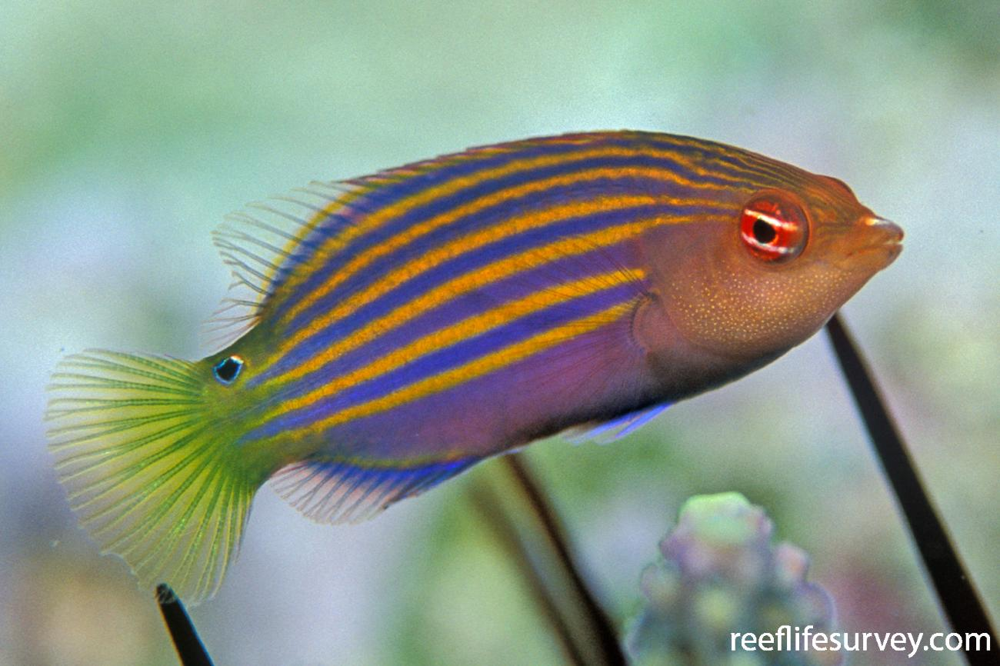
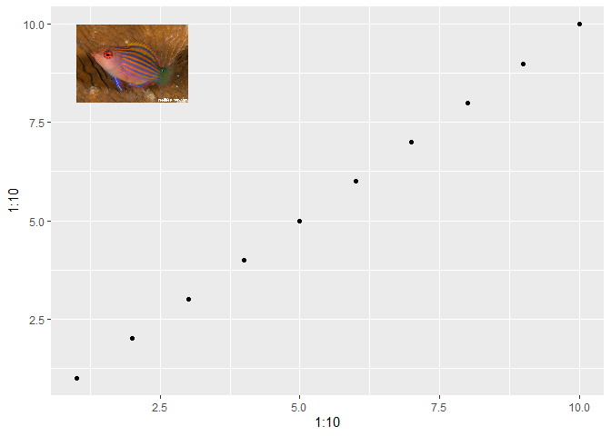

<!-- README.md is generated from README.Rmd. Please edit that file -->

# fishsizefunctions

<!-- badges: start -->
<!-- badges: end -->

The goal of fishsizefunctions is to download species photographic images
from the Reef Life Survey website into R.

## Installation

You can install the development version of fishsizefunctions from
[GitHub](https://github.com/) with:

``` r
# install.packages("devtools")
devtools::install_github("fishsizeproject/fishsizefunctions")
```

## Example

A simple example, let’s download an image of the species
*Pseudocheilinus hexataenia*.

``` r

library(fishsizefunctions)

get_species_image("Pseudocheilinus hexataenia")
```



or you can load multiple images of the same species. In the below
example, there are not 30 images on the Reef Life Survey website,
therefore only the maximum number of available images in used.

``` r
get_species_image("Pseudocheilinus hexataenia", 1:30)
```

or you can include the images into a ggplot

``` r
library(ggplot2)

my_img <- get_species_image("Pseudocheilinus hexataenia", 2)

ggplot() +
  aes(x = 1:10,
               y = 1:10) +
  geom_point() +
  {if(!is.null(my_img))  annotation_raster(my_img,
                                                   xmin = 1,
                                                   xmax = 3,
                                                   ymin = 8,
                                                   ymax = 10) }
```


